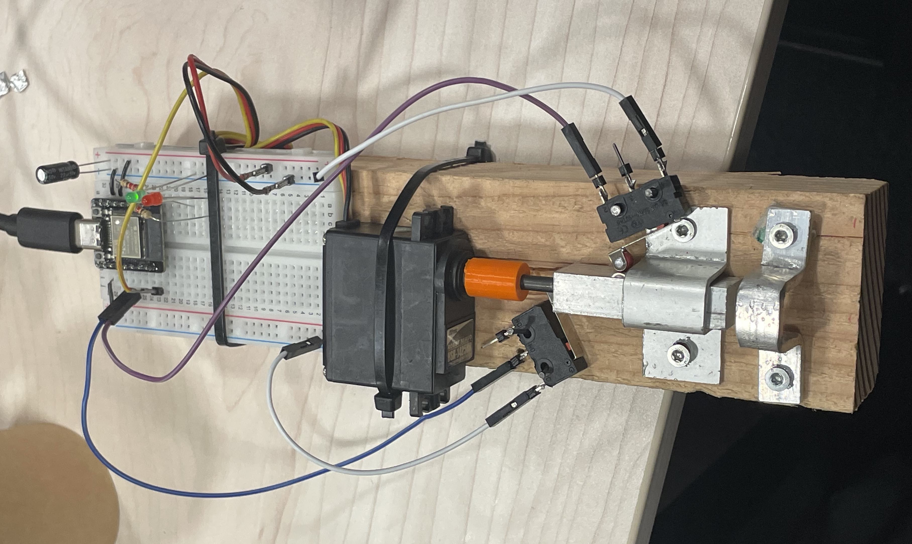
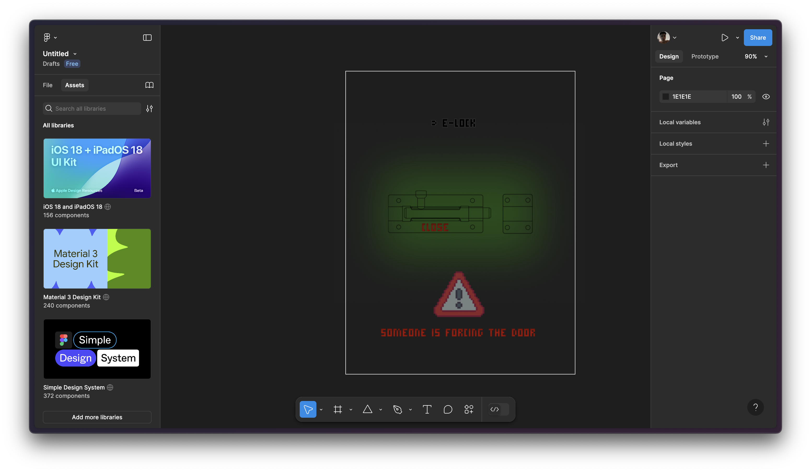

# CS Project

> This week focused IoT with Espressif's hardware.

Before the final project, we learn about :
- WebSocket and how to implement it on esp32 with Arduino IDE.
- Design with Figma
- HTML/CSS/JS

**Disclaimer :**

In this project, I deal with a lot of the esp32 peripherics so for optimisation, binary size and purpose, I will use ESP-IDF instead of Arduino.

## E-Lock (project)

> The goal here is to make a connected slide lock fixed to a door which you can control with your phone.

Requierements:
- On battery with long autonomy
- Proper access point with WPA3 auth mode
- Robust fabrication
- Compact
- Good error handling (low battery, door not closed properly...)
- Web interface
- WebSockets
- Simple and effective Web design

#### 1 - Hardware

Part list:
- lipo 3.7v 4000mWh
- esp32c3 mini
- sd card slot (for website files)
- HSR1425CR continuous servo motor
- 2x endstops
- aluminium lock
- steel threaded rod M4 w/nut
- some led and resistor

First, I made the locking part by hand with aluminium. The moving part is a aluminium rectangle with a hole and an encastred nut for the threaded rod. I attached the prototype on a piece of wood. Then I had to 3D print a coupling piece to attach the rod to the motor. 

I tried to use a simple brushed dc motor and control it with the L298N ic, but these kind of motor are designed to be just fast, but no torque so the whole system was motionless. The only torquey motor I had was this servo, now the system moves but it is really slow. The best would be a dc motor with a gearbox.

To detect the closed and the opened position, I put two endstops.

#### 2 - Software

##### i - Front-End

I wanted a simple site. I first designed it on Figma.

You just click on the lock to toggle it and errors can appear below.

The HTML implementation was quite simple. The script just allows to toggle the lock visually and physically by sending a message to the server. It also listens to the server and act accordingly.

##### ii - Back-End (esp32) :

Periperics used:
- Wifi
- LED control (for pwm)
- SPI (for sd card)

First I initialized the Wifi Access Point with a proper SSID and Password. Then I created a HTTP Server with WebSocket. I used mDNS to have this nice ip "*elock.local*". Next I read the web files on the sd card and send it to the front.

I have a task running aside to check all the inputs of my esp and send a message accordingly to the front.
For example if the close endstop is closed, I send a JSON {state: "close"}.

#### 3 - Conclusion

Despite the speed of the lock, the prototype is pretty nice and finished. Here is a demo:

